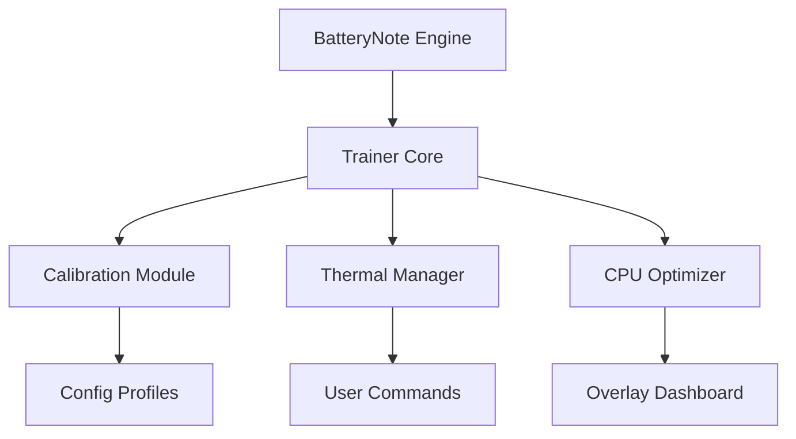

# BatteryNote Trainer ⚡

The **BatteryNote Trainer** is a lightweight enhancement suite designed to elevate how you manage power, productivity, and runtime efficiency. Built for creators, testers, and notebook enthusiasts, it provides direct access to BatteryNote’s internal monitoring parameters — letting you optimize performance, control battery calibration, and adjust refresh behavior with precision.

Whether you’re benchmarking systems, testing power draw, or simply extending laptop longevity, this trainer gives you real-time control over performance profiles and battery analytics in one clean interface.

---

## 🧭 Overview

The **BatteryNote Trainer** enhances your device’s power monitoring ecosystem by syncing directly with BatteryNote’s runtime data layer. Instead of manually toggling settings, you can now fine-tune calibration intervals, thermal thresholds, and charging behavior in real time — creating a fully optimized environment for both performance and battery preservation.

[!IMPORTANT]

> The trainer makes *temporary runtime adjustments only*. No permanent firmware or registry edits occur.

---

## ⚙️ Key Features

* **🔋 Smart Calibration Mode:** Balance power cycles for smoother charge detection.
* **⚙️ CPU Efficiency Tuner:** Adjust background app scaling and resource prioritization.
* **🌡 Thermal Threshold Control:** Set fan or throttling behavior by custom degree range.
* **🕒 Refresh Interval Editor:** Change data collection frequency for faster feedback.
* **📊 Live Overlay Dashboard:** View temperature, voltage, and capacity in real time.
* **💾 Config Profiles:** Save and load multiple performance setups instantly.

Example Config:

```ini
[TRAINER_CONFIG]
SmartCalibration=True
CPUBoost=0.9
ThermalLimit=78
RefreshInterval=2
OverlayEnabled=True
```

[!NOTE]

> Settings can be updated while BatteryNote is active. All values revert automatically when the trainer is closed.

---

## 🧰 Setup & Usage

1. **Download** the verified BatteryNote Trainer build.
2. **Extract** the package to your BatteryNote directory.
3. **Run** `BatteryNoteTrainer.exe` as Administrator.
4. **Open BatteryNote**, then press `F1` to open the trainer overlay.
5. **Modify settings** using sliders or numerical inputs.

Command Example:

```bash
BatteryNoteTrainer.exe /profile="EnergySaver.cfg"
```

[!WARNING]

> Launch the trainer *after* BatteryNote has initialized for best data accuracy.

---

## 💻 Compatibility

| Platform          | Status | Notes                                     |
| ----------------- | ------ | ----------------------------------------- |
| Windows 10/11     | ✅      | Fully supported                           |
| Laptop Devices    | ✅      | Optimized for portable systems            |
| Desktop PCs       | ⚙️     | Limited features (no battery calibration) |
| BatteryNote v2.1+ | ✅      | Full data sync                            |
| Controller Input  | ❌      | Keyboard/mouse only                       |

Accessibility: The overlay includes light/dark modes, colorblind-friendly graphs, and scalable text.

---

## 🧩 Workflow Diagram



---

## 🧠 Custom Presets

**Energy Saver Mode**

```ini
[PRESET_SAVER]
SmartCalibration=True
CPUBoost=0.7
ThermalLimit=70
RefreshInterval=5
OverlayEnabled=True
```

**Performance Boost Mode**

```ini
[PRESET_PERFORMANCE]
SmartCalibration=False
CPUBoost=1.2
ThermalLimit=85
RefreshInterval=1
OverlayEnabled=True
```

**Silent Mode (Low Fan Noise)**

```ini
[PRESET_SILENT]
SmartCalibration=True
CPUBoost=0.8
ThermalLimit=65
RefreshInterval=3
OverlayEnabled=False
```

Switch between profiles instantly using `F2`, `F3`, and `F4`.

---

## 💬 FAQ

**Q: Does it affect battery lifespan?**
A: No — the trainer optimizes cycle calibration without forcing high-load states.

**Q: Can it run in the background?**
A: Yes, it uses minimal resources (<1% CPU load).

**Q: Is it compatible with external batteries or docks?**
A: Yes — values update automatically when power source changes.

**Q: Will it void device warranty?**
A: No, it does not modify firmware or manufacturer settings.

**Q: How do I restore defaults?**
A: Press `CTRL + R` to reset all values to BatteryNote’s standard parameters.

---

## 🚀 Update Roadmap

| Version | Feature                   | Status     |
| ------- | ------------------------- | ---------- |
| v1.5    | Adaptive Cooling Profiles | ✅ Released |
| v1.6    | Voltage Graph Overlay     | 🚧 Testing |
| v1.7    | Battery Wear Predictor    | 🧩 Planned |

---

## 🏁 Final Thoughts

The **BatteryNote Trainer** is a must-have companion for anyone looking to get the most out of their BatteryNote setup. With real-time optimization and easy-to-use profiles, it delivers greater control over your device’s efficiency, temperature, and power cycles — all without touching a single firmware setting.

Stay optimized. Stay efficient. Keep your system charged for what matters most.

---
